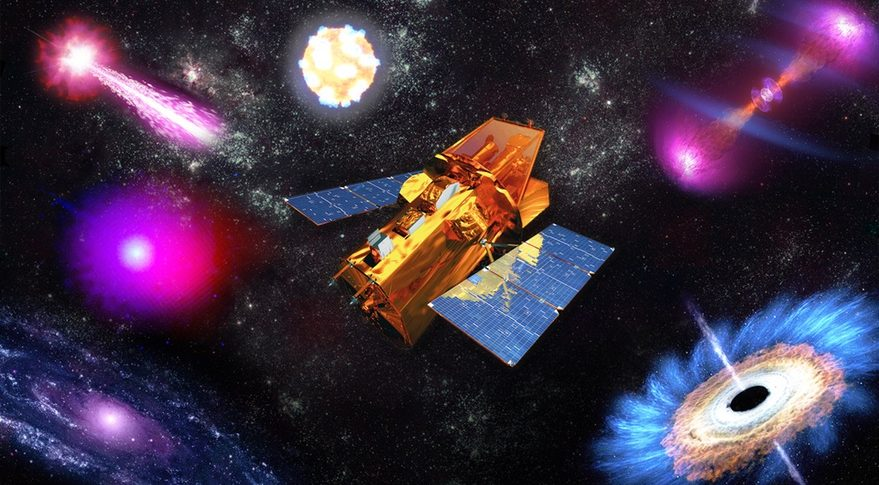

This script is designed to request and download light curves from the SWIFT telescope

The program is launched through a command such as:

python3 GarryPovar.py "Name"

where "Name" is the name of the object - mainly cosmetic, to be used in the find of the object

