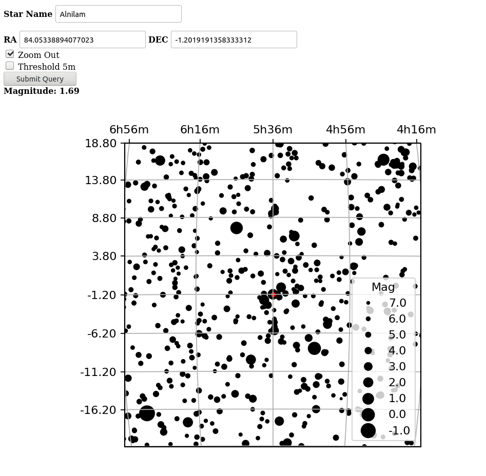
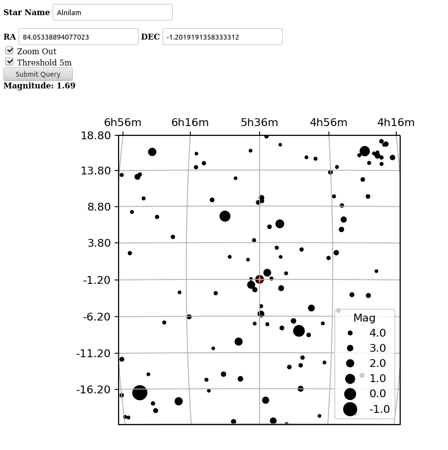
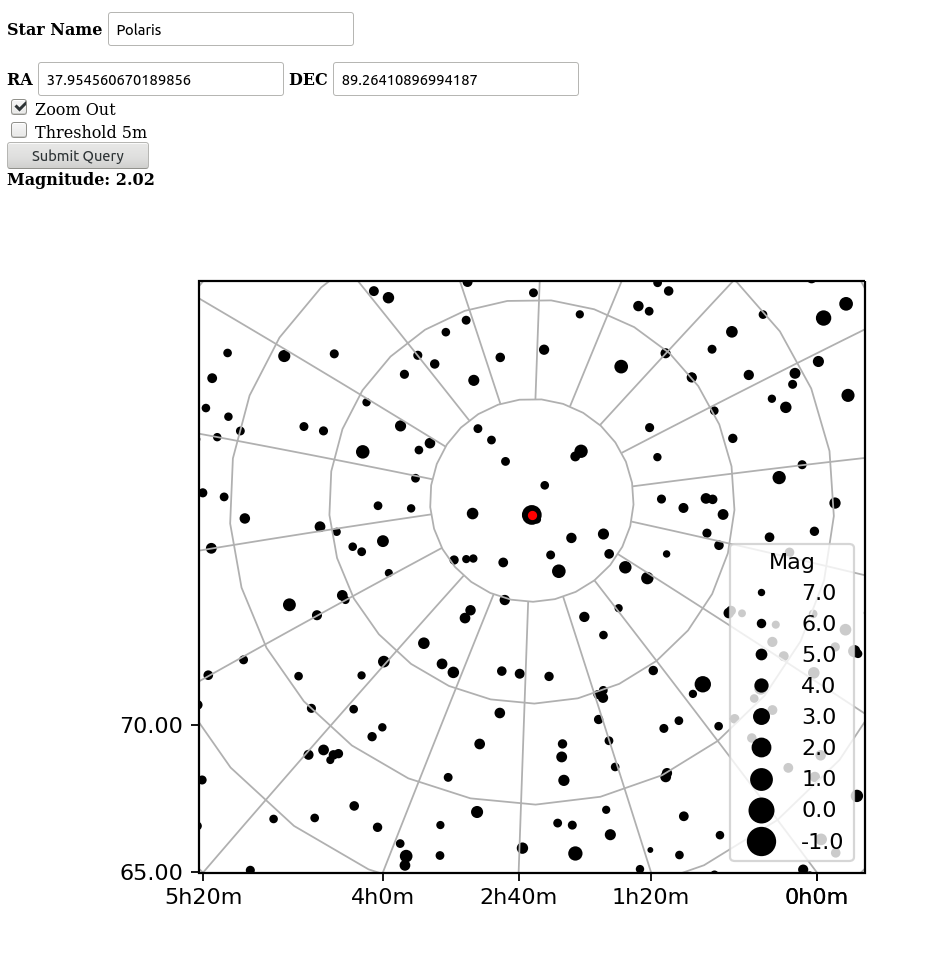

Внимание!
Программе для работы требуются следующие библиотеки: numpy, astropy,
matplotlib, flask, cartopy.
Cartopy, в частности, требует наличия cython, libproj-dev, proj-data, proj-bin,
libgeos-dev.

Веб-сайт на основе flask, рисующий участок звёздного неба в районе
указанного объекта. Объект указывается по имени или координатам. Для
получения координат сервер залезает на simbad и вытаскивает координаты,
звёздную величину и имя.
Если объект указан через координаты, то выводится местонахождение ближайшего
найденного объекта simbad.
Имеется два варианта масштаба, который указывается посредством галочки Zoom
Out. Также есть возможность исключить из изображения звёзды тусклее 5-й
величины (галочка Threshold 5m).

**Для запуска исполнять skyStar.py.**

**Разворачивается по адресу 0.0.0.0:8888**

Примеры:

_______________________________________________________________________________

_______________________________________________________________________________

_______________________________________________________________________________

_______________________________________________________________________________
